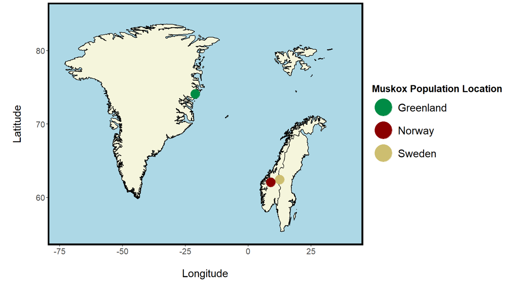
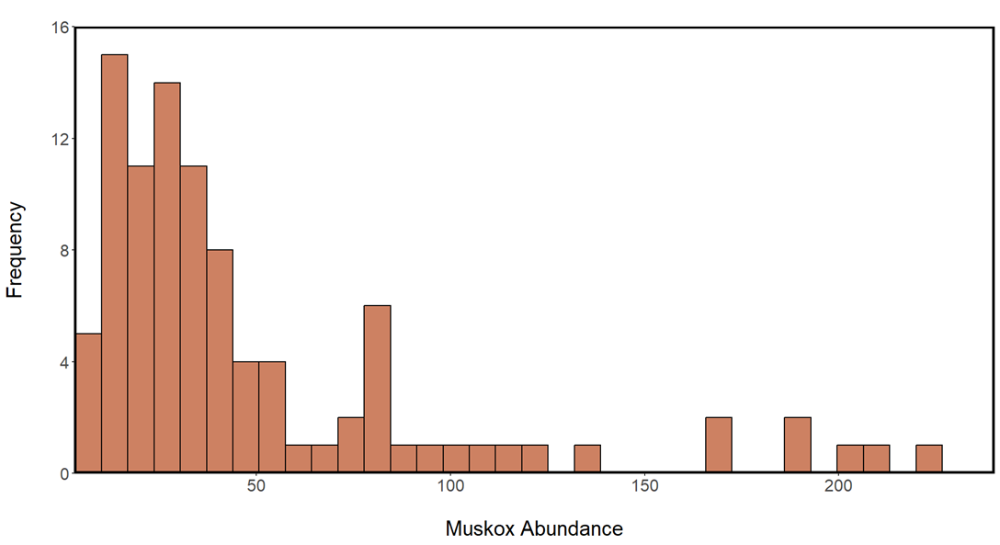
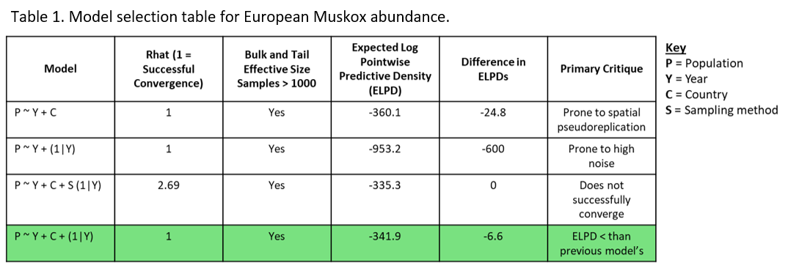
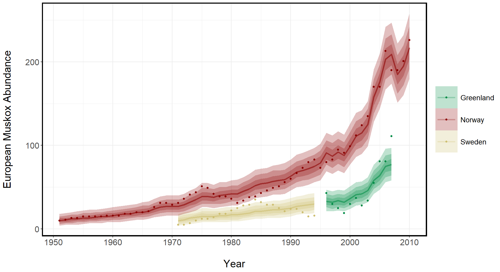
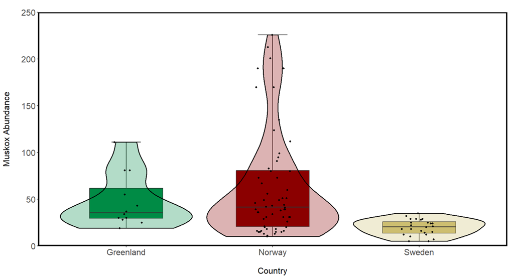
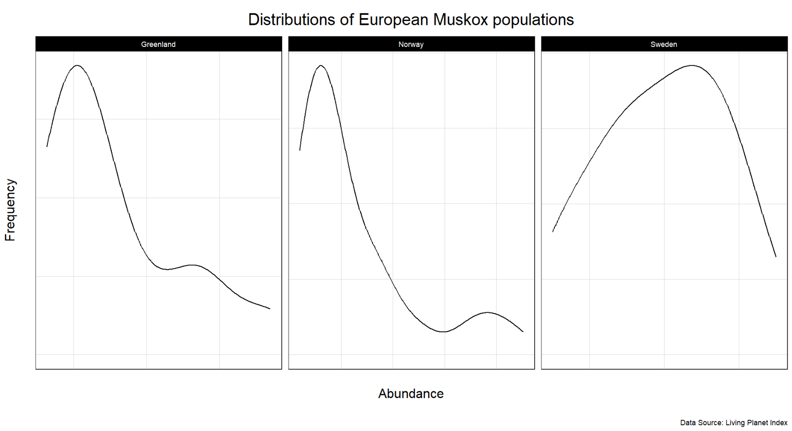
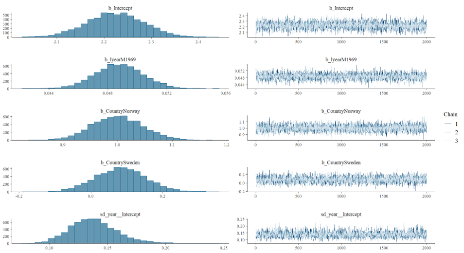
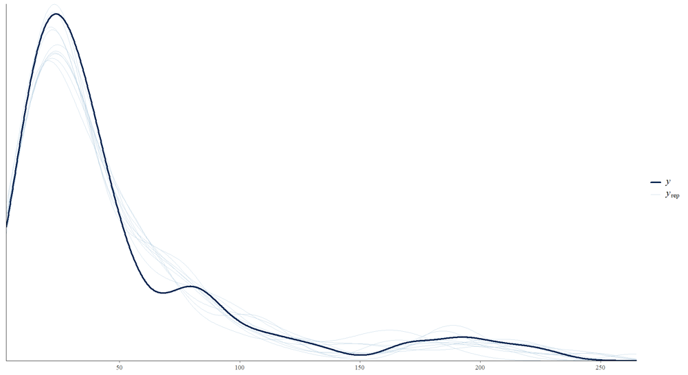

```{r setup, include=FALSE}
knitr::opts_chunk$set(echo = TRUE)
library(knitr)  # For figures, tables and matrices
library(rmarkdown)
```
\begin{center} \LARGE \textbf{Unmusked: European Muskox Populations Increased Between 1951 and 2010} \end{center}

##### Key Words: *Bayesian modelling, spatial visualisation, model selection, data wrangling, data visualisation*
\
\
[**Introduction**]{.underline}

Habitat loss, climate change and anthropogenic activity have induced population decline in a multitude of species over the last century and beyond (Cardinale et al., 2012; Powers and Jetz, 2019). As populations decrease in size and connectivity, their resilience to environmental fluctuation, disease and genetic bottlenecks are inhibited (Capdevila et al., 2020) which increases their extinction risk. Extinction events can cause trophic cascades (Sanders et al., 2018), ecosystem service loss (Keyes et al., 2021) and accelerated climate change (Kaiho, 2022), all of which can carry severe consequences for humans and habitats alike (Ceballos et al., 2015).

In October 2024, the Living Planet Index (LPI) Report was released which exposed the severity of global species’ population declines. It found that, on average, species’ populations have declined by 73% between 1970 and 2020 (LPI & WWF, 2024).The future of the Arctic’s biodiversity and community composition is particularly uncertain; the Arctic’s rate of temperature increase is 3 times that of the global average (Steele, Ermold and Zhang, 2008; Box et al., 2019). As a result, the Arctic has become an important area of study for monitoring the effects of climate change (Hirawake et al., 2021). While predictions have been made surrounding the future of Arctic diversity (Hope et al., 2015), there is contention surrounding the population trends of many Arctic fauna, including Muskox.

The Muskox (Ovibos moschatus) is an ancient species of the Bovidae family, native to the Arctic. Today, Muskox populate northern regions of North America and Europe including the Arctic Circle where they are embedded into the indigenous peoples’ cultures and traditions (Tomaselli et al., 2018).Muskox are documented to have low genetic diversity which makes them vulnerable to environmental stochasticity, an especially imposing threat in the Arctic (Pečnerová et al., 2024). Furthermore, the ICUN Red List has labelled their numbers as ‘decreasing’ despite their conservation class being ‘least concern’ (IUCN, 2020). However, the existing primary literature on Muskox populations has revealed a number of different trends.

The largest Muskox population, which encompasses 41% of the global population (Canada Arctic Archipelago), has been decreasing since the beginning of the century (Cuyler et al., 2020). In contrast the majority of Alaskan populations have been documented as increasing (Tomassini, van Beest and Schmidt, 2019). The long term trends of European populations, however, remain largely understudied. Understanding Muskox population trends is key for formulating effective short- and long-term conservation strategies to mitigate extinction and the negative socio-ecological effects that may follow (Cuyler et al., 2020).

In turn, using data from the Living Planet Database (LPI, 2024) and Bayesian modelling, European Muskox population change between 1950 and 2020 will be investigated. European Muskox abundance is expected to have shown little change during this period owing to the aforementioned contrasting trends shown in the primary literature.
\
\
\
\
[**Methods**]{.underline}

[Data]{.underline}\
The LPI dataset contains population data for thousands of species (5,268) across a multitude of populations (38,427) from 1950 – 2020 (LPI & WWF, 2024). While this creates many possibilities for analyses, it was imperative to wrangle the data appropriately which required multiple steps. The readily accessible data was downloaded from the LPI website as a ‘.csv’ file. From here, all data wrangling, visualisation and analysis was conducted in R 4.4.0.
\
\
[Wrangling]{.underline}\
Firstly, the original dataset is in wide format whereby there is a unique column for each year containing population data. To facilitate analysis, the data was reshaped into long format using the ‘gather()’ function (dplyr package). The year columns were gathered into a single ‘year’ column, while their corresponding population values were gathered into a single column named ‘pop’. This ensured that each observation was contained in a row and the response variable (population) in a single column. Next, the data was filtered so that only European Muskox populations remained (the geo-political area and species of interest). This encompassed three 3 populations (Greenland (n = 12), Norway (n = 60), and Sweden (n = 24)) whose coordinates were included in the dataset and subsequently mapped using the ‘sf()’ package (Fig. 1).
\
\
```{r, echo=FALSE, fig.cap="The locations of European Muskox populations.", fig.height=100, fig.width=120, out.width="100%"}

```

Any non-numeric population abundance entries (characters or ‘NULL’ values) were omitted before the remaining values were converted to class ‘integer’ as this is characteristic of count data and allows the prospective model to treat it as such. Additionally, the ‘parse()’ function was used in parallel with ‘mutate()’ to remove existing characters from the year columns to allow for analysis. This allowed the inference that there was abundance data for at least one Muskox population between 1951 and 2010. Finally, the variable ‘year’ was centred as ‘year2’ to avoid completing this step during each of the model’s iterations (to be discussed further), thus enhancing model efficiency and ease of interpretation. It is important to note that while the LPI data contains a host of population metrics (e.g. egg counts, breeding pairs, individuals), all Muskox population entries used same units (individual counts) and thus no standardisation/ scaling was required.
\
\
Complete wrangling code:
```{r, eval = FALSE}
# Data Wrangling ----
ox <- data %>% 
  gather("year", "pop", 31:101) %>%     # Reshape data to long form
  filter(Common_name == "Musk ox",      # Filter for species of interest: Musk ox 
         Region ==  "Europe",           # Filter for the European populations 
         !is.na(as.numeric(pop))) %>%   # Remove non numeric population counts ('NA's)
  mutate(year = parse_number(year),     # Remove characters from 'year' column
         pop = as.integer(pop),         # Poisson requires response variable to be integer 

```

[Analysis Framework]{.underline}\
A Bayesian modelling framework was chosen to analyse the data. The decision to use this form of statistical modelling rather than a frequentist model was chosen for two primary reasons. Firstly, the Bayesian analysis is thorough; the framework supports models that run thousands of iterations to determine the most accurate posterior distribution. These are accompanied by respective credibility intervals which can be used to determine the significance of relationships and the effect sizes of independent variables. This offers more nuance during interpretation than frequentist frameworks that are limited to dichotomous outcomes i.e. p-values that are ‘significant’ or not.

Secondly, while the frequentist approach relies solely on data or 'evidence', the Bayesian model incorporates prior distributions (priors) into analysis. These priors are combined with the data to create a posterior distribution. While this introduces an element of subjectivity to analysis, it offers another layer of depth that facilitates more nuanced and sophisticated interpretation of relationships. Before deciding on a final model, the data’s error structure was assessed and a vigorous model selection process was undertaken.
\
\
[Error Structure]{.underline}\
Understanding the response variable’s distribution and error structure is key for forming reliable models. The response variable of interest is Muskox abundance which is ‘count data’. Count data is discrete which means it is only non-negative integers. Furthermore, count data is characterised by the poisson distribution (right-skewed) whereby most of the data is concentrated around the mean (lambda) with a few extreme outliers that extend the tail of the distribution. In turn, it was expected that the Muskox abundance distributions would resemble a poisson distribution. To verify this, a histogram and distribution density plots were created for the combined and individual Muskox populations, respectively. The histogram confirmed that the combined distribution was poisson (Fig. 2). Furthermore, the frequency density plots for the individual populations showed that both the Greenlandic and Norwegian populations had poisson distributions (Appendix 1). While the Swedish population density plot appeared more Gaussian, overall, it is apparent that a poisson error structure is the most appropriate to progress with during the model selection process.
\
```{r, echo=FALSE, fig.cap="Histogram showing European Muskox population abundance frequencies between 1951 and 2010. (n = 96).", fig.height=100, fig.width=120, out.width="100%"}

```
\
[**The Model**]{.underline}

I conducted multiple Bayesian models using the ‘brms’ package, which were subsequently scrutinised and compared using ‘leave-one-out analysis’ (Table 1). This assigns a ELPD score to the model’s predictive ability which can be compared against other models whereby a higher score is indicative of a better predictive ability. Convergence was checked (for Rhat to be 1), as was the bulk and tail sample sizes (to be \> 1000) to ensure that a sufficient number of iterations were run and converged around accurate posterior distributions.
\
```{r, echo=FALSE, fig.cap="", fig.height=100, fig.width=120, out.width="100%"}

```
\
\
The final Model:

```{r, eval = FALSE}
# Bayesian Statistical Analysis ----

# Setting (uninformative) priors
priors <- c(
  set_prior("normal(0, 10)", class = "b", coef = "year2"),        # Prior for year2
  set_prior("normal(0, 10)", class = "b", coef = "CountryNorway"),# Prior for Norway
  set_prior("normal(0, 10)", class = "b", coef = "CountrySweden"),# Prior for Sweden
  set_prior("normal(0, 10)", class = "Intercept"),                # Prior for the intercept
  set_prior("exponential(1)", class = "sd")                       # Prior for random effects
)

# The model
ox_mbrms <- brms::brm(pop ~                # Population = response variable
                      year2 +              # year2 = explanatory variable
                      Country +            # Country = fixed effect (3 levels)
                      (1|year),            # year = random effect 
                      data = ox,           # The data
                      family = poisson(),  # Identified error structure
                      chains = 3,          # 3 chains for robustness (ensure convergence)   
                      iter = 5000,         # Run model 5000 times
                      warmup = 3000        # Omit the first 3000 results.
```

Each aspect of the model serves a purpose and its inclusion will now be detailed and justified.

[Response Variable]{.underline}\
The response variable is European Muskox population abundance (‘pop’, n = 96). It’s relationship with time is the study’s primary focus.
\
\
[Fixed effects]{.underline}\
As a result, time (‘year2’) is the primary independent variable. This variable was centred during wrangling so it begins from 1. Sampling location (‘Country’) has also been included as a second fixed effect. This categorical variable is made up of 3 levels: Norway, Sweden and Greenland. By incorporating the grouping of country, the model will account for the effect of sampling size and sampling interval on the model. In turn, Muskox population abundance change can be compared between countries.
\
\
[Random Effects and Missing Data]{.underline}\
Although ‘year2’ is a fixed effect, it is important to account for random annual variations that influence the Muskox populations. Each population shares a similar latitude around the Arctic Circle. As a result, a strong correlation in environmental fluctuations between each country is likely to be high, especially between the bordering Nordic countries, Sweden and Norway (Fig. 1). These shared climatological variations between years prompts the addition of 'year' to the model as a random effect to account for this shared effect and mitigate pseudoreplication. Given that it has \> 5 levels, it is well suited to being a random effect in the model. That said, the sampling years are sporadic and some years only have one population sample. This will nullify the effect of environmental fluctuations variation between years for those years - there is no variation in a given year if n = 1. Missing data was omitted from the analyses rather than adopting imputation to avoid creating unnecessary bias through data that may be inaccurate.

The sampling method (‘Units’) has not been included as a random effect. This is because any noise caused by sampling method will already be accounted for in the 'Country' fixed effect (each country likely has a slightly different, but consistent, sampling strategy). Including sampling method in addition to 'country' and 'year' increases the models complexity beyond the point at which it can successful converge (Rhat does not equal 1, Table 1.).
\
\
[Crossed and Nested effects]{.underline}\
The fixed effect ‘Country’ is not treated as a crossed effect because the 3 populations would only experience one level of Country; migration between the populations is impossible due to geographical barriers resulting in isolated populations. In turn, country is completely uncrossed - all individuals have only experienced one level of 'Country'. This essentially means that there is no obvious hierarchal structure to the data.
\
\
[Priors]{.underline}\
Weak (uninformative) priors were chosen for the model. This means that they have little bearing on the posterior distribution. The justification for this is that there is little research on European Muskox populations. Furthermore, as discussed, the Muskox population trends elsewhere in the world have showing contrasting trajectories (Tomassini, van Beest and Schmidt, 2019; Cuyler et al., 2020). In turn, the effect size and the variation of the priors’ parameters have been engineered to have a little effect on the posterior distribution (effect size coefficient = 0, standard deviation = ± 10). This reflects a lot of ecological models and will result in the posterior distribution leaning towards the distribution of the evidence.
\
\
[Error Structure]{.underline}\
As discussed, overall, the data exhibits a poisson distribution (Fig. 2). This provides useful information for the model’s ‘family’ argument which was ‘poisson()’. This allows the model to create more reliable inferences that are account for the characteristics of the poisson error structure. For example, it ensures that predicted lambda values are non-negative.
\
\
[Iterations]{.underline}\
Each model ran 5000 iterations, 3000 of which were ‘warm up’ iterations, across 3 chains. The warm-up iterations allowed the model to stabilise and avoid including iterations that did not converge around the accurate posterior distribution.
\
\
[Final checks and Transformations]{.underline}\
Before the model outputs could be assessed, model convergence was checked through Rhat values and caterpillar plots (Appendix 2). Then the models fit was checked by comparing its posterior distribution against those of the data (n = 10) (Appendix 3). This exhibited good model fit; the distributions are similar.
\
\
[Back Transformation]{.underline}\
Because of the poisson family argument, the model coefficients have been log-transformed. Therefore, their exponents were calculated to transform them into their original form. Considering that there is only one-unit type (individual muskox) back-transformation is simple.
\
\
\
[**Results**]{.underline}\
Relationships were deemed ‘significant’ if the 95% credibility did not span 0. The model revealed that European Muskox abundance significantly increased between 1951 and 2010 ($\beta$ = 0.06, 95% CI = 0.05 to 0.06, standard error = ± 0.001) at a rate of 9 individuals (6 %) per year (Fig. 3). The population was also an important determinant of abundance change; in comparison to the Greenlandic (reference) population, Norwegian Muskox populations growth was 2.7 times larger at a rate of 24 new individuals per year ($\beta$ = 1.00, 95% CI = 0.91 to 1.10, standard error = ± 0.05). No significant relationship was found when comparing the Swedish population to this reference ($\beta$ = 0.1, 95% CI = -0.04 to 0.24, standard error = ± 0.07).

The raw data exposed high variation between Muskox populations. The Norwegian populations had the most individuals on average (mean = 63, sd = ± 57, n = 60) whereas the Swedish population had the fewest (mean = 20, sd = ± 9, n = 24) (Fig. 4).
\
\
\
\
\
\
```{r, echo=FALSE, fig.cap="Modelled European Muskox Population Trajectory and Credibility Intervals (1951 - 2010). The points represent the raw data while the shaded regions are the modelled 95%, 0.80% and 0.50% credibility intervals.", fig.height=100, fig.width=120, out.width="100%"}

```


```{r, echo=FALSE, fig.cap="Box- and violin-plot showing European Muskox population abundances (1970 - 2010) in Greenland (n = 12), Norway (n = 60) and Sweden (n = 24). The boxplots show the data’s range, median and interquartile ranges while the violin plot illustrates the data density distributions.", fig.height=100, fig.width=120, out.width="100%"}

```
\
\
\
\
\
\
\
[**Discussion**]{.underline}\
European Muskox populations increased annually from 1951 to 2010 by, on average, 9 new individuals per year. The importance of adding of 'Country' is as a fixed effect is also evident. Fig. 3 illustrates how each European population show similar trends (i.e. increase over time). However, is also clear that the rate of increase differs between countries. For example, Norwegian populations show the highest rate of population growth, particularly between 2000 and 2006. This was likely a catalyst for the model outputs which found that this population had the highest average annual increase of any population (24 per year). The Swedish population was the only population which was not found to be increasing when modelled alone (95% CI = -0.05 – 0.22).

An important factor that may have induced the disparities in results between countries is sampling frequency. There is a considerable difference in the number of samples between groups (Fig. 4). For example, Norway’s population was measured over the largest temporal range (1951-2010) whereas the Swedish population was measured between 1975 and 1995 which did not overlap at all with the Greenlandic sampling timeframe (1996-2007). This sporadic sampling affects the results for each population because sample size is important determinant of model confidence and in turn, the credibility intervals. It may be that if there was more data for individual populations, the results would be more convincing. That said, the model for the combined Muskox abundance still shows that overall, the European Muskox population is growing over time.

The inclusion of the random effect "Year" is also key and is manifested in Fig. 3. In the years where only 1 or 2 populations were sampled, the respective abundance trends are heavily influenced by the population fluctuations of other populations. For example, from 2008 inwards, the only sampled abundance is the Norwegian population. In turn, there is no variation between years with other populations because there are no other sampled populations. As a result, the trajectory of the Norwegian population’s credibility intervals are tightly correlated with the raw data. The weak prior used in the model further contributed to the strong influence of the raw data.

Although it is justified to argue that the 3 populations (all within the Arctic Circle) have correlated annual environmental fluctuations, better understanding the extent to which climactic fluctuations between countries are spatially correlated would prove useful for determining whether implementing year as a random factor is the correct decision. Furthermore, a wider range of meta data would allow for a more accurate model selection process whereby more sources of variation and/or factors that limit independence (an assumption of the model) could be considered.

The results of the study are particularly interesting when considering where they are situated relative to the wider literature. As discussed, prior to this study the existing literature on Muskox population abundance showed contrasting trends. For example, Cuyler et al. (2020) find that multiple populations have seen decreases in abundance in recent years while others have remained stable. In contrast Greenlandic Muskox populations are known to have increased from the mid to late 1900s (Forchhammer and Boertmann, 1993), while some Alaskan populations have seen decreases that have continued into the 21st century (Afema et al., 2017). In turn, these results provide a valuable insight into a species’ vulnerability whose global population trends remain uncertain. While this study’s results suggest that, overall, European Muskox populations are increasing, there have been fluctuations (Fig. 3). Therefore, the implementation of well-informed conservation and population management measures should remain a priority of policy makers to mitigate future losses.
\
\
\
\
[**Limitations**]{.underline}\
The model’s applicability is limited to some extent. Firstly, this is due to the sporadic sampling events for different populations. For example, there was no overlap between the abundance measurements for the Greenlandic and Swedish populations which sampled significantly fewer times than the Norwegian population (48 and 36, respectively). Given the importance of sample size for credibility interval width, the results may have shown considerably different trends if there was data available for all three populations across the entire timeframe. This is why it would also be useful if there were pre-existing studies on European Muskox abundances; the hypothetical data would prove valuable for informing more informative priors and, in turn, a better informed model. This also brings attention to the fact that the data was only sampled up to 2010. While this offers important insights into the trends up to this point, weather events are becoming less predictable, particularly in the Arctic where rates of warming are highest (Box et al., 2019). As a result, an up to dataset on Muskox abundance is necessary to improve the model’s applicability and reliability in informing policy and conservation management.

Spatially correlated environmental conditions between the populations due to similar latitudes and longitudes were accounted for in the model through the random effect of ‘year’. However, if the true standardised climatological data was available then then this could be incorporated to improve the models accuracy as it would better predict the variance explained by climatological fluctuations. Moreover, there are other sources of variation that the dataset doesn’t contain and thus are not accounted for in the model. Therefore, in addition to accurate meteorological data, other sources of variation that violate assumptions of independence would be useful. For example, given the relatively close proximity of the Norwegian and Swedish populations (Fig. 1), it is plausible that factors such as disease could affect trends in these population abundance trajectories simultaneously. This hypothesis is partly evidenced by Schmidt et al., (2015) who find that Muskox abundance is a function of disease as well as spring snow coverage which influences food availability and calf mortality. Furthermore (Afema et al., 2017) find that disease has played a large role in dwindling Alaskan populations.

In light of these findings, a more comprehensive dataset over a larger temporal range with more metadata would undoubtedly contribute to a more reliable model for determining European Muskox population abundance trends. This would also facilitate well informed predictions of how Muskox abundances may trend into the future which would be especially valuable for conservationists.  
\
\
\
\
[**Conclusion**]{.underline}\
The goal of this study was to quantify European Muskox population abundance change eith time. Additionally, the variation in abundance trends between European populations was inferred. Through wrangling the LPI dataset, followed by a Bayesian model selection process, the study concludes that European Muskox population abundance has increased between 1951 and 2010 (95% CI = 0.05 to 0.06; Fig. 3), at an average rate of 9 individuals per year. Individually, both the Greenlandic and Norwegian Muskox populations were inferred to have increased whereas this could not be confidently deduced in the Swedish population (95% CI = -0.05 – 0.22).

Future studies now have the opportunity to build on these findings. To improve the model's accuracy and predictive power, more  data surrounding Muskox disease and their respective countries' conservation efforts should be gathered to explain more variance. Additionally, given that the global Muskox gene pool is extremely low in diversity (Pečnerová et al., 2024), each population's genetic diversity should be factored into the model. This would highlight how populations differ in the susceptibility to environmental fluctuation depending on their genetic diversity.

Ultimately, the study provides important insights into Muskox abundance trends. However, the populations should be continually monitored to understand ongoing changes in the face of drastic climate change (Canteri et al., 2022). The species' cultural, ecological and economic importance all need to be conserved to ensure their continued presence which has existed since before almost 100,000 years ago (Kutz et al., 2017). With a better knowledge of the Muskox abundance trends, each of the aforementioned countries has the opportunity to set a precedent for Muskox conservation goals and population management plans.
\
\
\
\
[**References**]{.underline}\
Afema, J.A. et al. (2017) ‘Disease Complexity in a Declining Alaskan Muskox Population(Ovibos mosschatus) Popualtion’, Journal of Wildlife Diseases, 53(2), pp. 311–329. Available at: https://doi.org/10.7589/2016-02-035.

Box, J.E. et al. (2019) ‘Key indicators of Arctic climate change: 1971–2017’, Environmental Research Letters, 14(4), p. 045010. Available at: https://doi.org/10.1088/1748-9326/aafc1b.

Canteri, E. et al. (2022) ‘Spatiotemporal influences of climate and humans on muskox range dynamics over multiple millennia’, Global Change Biology, 28(22), pp. 6602–6617. Available at: https://doi.org/10.1111/gcb.16375.

Capdevila, P. et al. (2020) ‘Towards a Comparative Framework of Demographic Resilience’, Trends in Ecology & Evolution, 35(9), pp. 776–786. Available at: https://doi.org/10.1016/j.tree.2020.05.001.

Cardinale, B.J. et al. (2012) ‘Biodiversity loss and its impact on humanity’, Nature, 486(7401), pp. 59–67. Available at: https://doi.org/10.1038/nature11148.

Ceballos, G. et al. (2015) ‘Accelerated modern human–induced species losses: Entering the sixth mass extinction’, Science Advances, 1(5), p. e1400253. Available at: https://doi.org/10.1126/sciadv.1400253.

Cuyler, C. et al. (2020) ‘Muskox status, recent variation, and uncertain future’, Ambio, 49(3), pp. 805–819. Available at: https://doi.org/10.1007/s13280-019-01205-x.

Forchhammer, M. and Boertmann, D. (1993) ‘The muskoxen Ovibos moschatus in north and northeast Greenland: population trends and the influence of abiotic parameters on population dynamics’, Ecography, 16(4), pp. 299–308. Available at: https://doi.org/10.1111/j.1600-0587.1993.tb00219.x.

Hirawake, T. et al. (2021) ‘Response of Arctic biodiversity and ecosystem to environmental changes: Findings from the ArCS project’, Polar Science, 27, p. 100533. Available at: https://doi.org/10.1016/j.polar.2020.100533.

Hope, A.G. et al. (2015) ‘Arctic biodiversity: increasing richness accompanies shrinking refugia for a cold-associated tundra fauna’, Ecosphere, 6(9), p. art159. Available at: https://doi.org/10.1890/ES15-00104.1.

IUCN, 2020, The IUCN Red List of Threatened Species in 2020 Available at https://www.iucnredlist.org/species/29684/22149286 Accessed 14/12/24.

Kaiho, K. (2022) ‘Relationship between extinction magnitude and climate change during major marine and terrestrial animal crises’, Biogeosciences, 19(14), pp. 3369–3380. Available at: https://doi.org/10.5194/bg-19-3369-2022.

Keyes, A.A. et al. (2021) ‘An ecological network approach to predict ecosystem service vulnerability to species losses’, Nature Communications, 12(1), p. 1586. Available at: https://doi.org/10.1038/s41467-021-21824-x.

Kutz, S. et al. (2017) ‘Muskox Health Ecology Symposium 2016: Gathering to Share Knowledge on “Umingmak” in a Time of Rapid Change’, Arctic, 70(2), pp. 225–236.

LPI, 2024, Living Planet Index database 2014. Available at: \< [https://www.livingplanetindex.org/) on 10.10.24

Pečnerová, P. et al. (2024) ‘Population genomics of the muskox’ resilience in the near absence of genetic variation’, Molecular Ecology, 33(2), p. e17205. Available at: https://doi.org/10.1111/mec.17205.

Powers, R.P. and Jetz, W. (2019) ‘Global habitat loss and extinction risk of terrestrial vertebrates under future land-use-change scenarios’, Nature Climate Change, 9(4), pp. 323–329. Available at: https://doi.org/10.1038/s41558-019-0406-z.

Sanders, D. et al. (2018) ‘Trophic redundancy reduces vulnerability to extinction cascades’, Proceedings of the National Academy of Sciences, 115(10), pp. 2419–2424. Available at: https://doi.org/10.1073/pnas.1716825115.

Schmidt, N.M. et al. (2015) ‘Long-term patterns of muskox (Ovibos moschatus) demographics in high arctic Greenland’, Polar Biology, 38(10), pp. 1667–1675. Available at: https://doi.org/10.1007/s00300-015-1733-9.

Steele, M., Ermold, W. and Zhang, J. (2008) ‘Arctic Ocean surface warming trends over the past 100 years’, Geophysical Research Letters, 35(2). Available at: https://doi.org/10.1029/2007GL031651.

Tomaselli, M. et al. (2018) ‘Local knowledge to enhance wildlife population health surveillance: Conserving muskoxen and caribou in the Canadian Arctic’, Biological Conservation, 217, pp. 337–348. Available at: https://doi.org/10.1016/j.biocon.2017.11.010.

Tomassini, O., van Beest, F.M. and Schmidt, N.M. (2019) ‘Density, snow, and seasonality lead to variation in muskox (Ovibos moschatus) habitat selection during summer’, Canadian Journal of Zoology, 97(11), pp. 997–1003. Available at: https://doi.org/10.1139/cjz-2018-0292.


\
\
[*Appendix*]{.underline}\


```{r, echo=FALSE, fig.cap="Appendix 1. European Muskox individual population distribution density plots between 1951 and 2010 in Greenland (n = 12), Norway (n = 60) and Sweden (n = 24).", fig.height=100, fig.width=120, out.width="100%"}

```

```{r, echo=FALSE, fig.cap="Appendix 2. Caterpillar plots showing model convergence.", fig.height=100, fig.width=120}

```

```{r, echo=FALSE, fig.cap="Appendix 3. Comparison between the model posterior distribution and the raw data distribution (n = 10). ", fig.height=100, fig.width=120}

```
\
\
\
\
\
\
\

[*Code*]{.underline}\
Please note, the raw data and all the relevant code for models, wrangling, figures etc. can be accessed in [my organised github repository linked here](https://github.com/prillex/fundamentals_project).

### Wrangling and Model Selcetion process
```{r, eval = FALSE}
# Matt Prill
# Fundamentals of Data Science
# Unsuccessful Models

# Libraries----
library(tidyverse)  # Range of packages e.g. dplyr
library(lme4)  # Linear Mixed modelling
library(brms)  # Bayesian Modelling
library(tidybayes)  # Add predicted draws
# ----
# ----
# Read Data---- 
data <- read.csv("data/LPI_2024.csv")

# ----
# ----
# Data Wrangling ----
ox <- data %>% 
  gather("year", "pop", 31:101) %>%  # Reshape data to long form
  filter(Common_name == "Musk ox",  # Filter for species of interest: Musk ox 
         Region ==  "Europe",  # Filter for the European populations (filter out Canada; not geographically or geo-politically European and only has 2 samples of very different values: would create unbalanced model)
         !is.na(as.numeric(pop))) %>%  # Remove non numeric population counts ('NA's)
  mutate(year = parse_number(year),  # Remove characters from 'year' column to allow model to treat as integer variable.
         pop = as.integer(pop))  # Poisson requires response variable to be integer


# ----
# ----
# Models ----

# Linear Model ----

# Example of mixed linear model (no assumption checks - I will be doing this for Bayesian)
mixed.lm <- lm(pop ~ year + Country + Units, data = ox)
summary(mixed.lm) # Potentially overfitted script, 

# ----
# ----
# Bayesian Hierarchical Linear Models ----

# Model for Country as Fixed Effect
ox_mbrms_country <- brms::brm(pop ~ I(year - 1950) + Country,  # Population = response variable, year = explanatory variable, Country = fixed effect (3 levels)
                           data = ox, family = poisson(), chains = 3,  # Data shows a poisson distribution so we use this prior 
                           iter = 5000, warmup = 3000)
# Summary Table
summary(ox_mbrms_country)

# Plot for Country as Fixed Effect 
(location_fit_ox <- ox %>%
    group_by(Country) %>%  # Group by Country so: Key = Country
    add_predicted_draws(ox_mbrms_country) %>%  # Adding the posterior distribution
    ggplot(aes(x = year, y = pop, color = ordered(Country),  # Splitting distributions between Country 
               fill = ordered(Country)))) +
  stat_lineribbon(aes(y = .prediction), .width = c(.95, .80, .50), alpha = 1/4) +  # Regression lines and Credibility Intervals 
  geom_point(data = ox) +  # Add raw data
  scale_fill_manual(values = c("springgreen4", "red4", "lightgoldenrod3")) +  # Colours
  scale_color_manual(values = c("springgreen4", "red4", "lightgoldenrod3")) +  # Colours
  theme_bw() +
  ylab("European Muskox abundance\n") +  # Y-axis label
  xlab("\nYear") +  # X-axis label
  theme_bw() +
  theme(legend.title = element_blank())


# Model for Year as Random Effect----
ox_mbrms_year <- brms::brm(pop ~ I(year - 1950) + (1|year),  # Population = response variable, year = explanatory variable, Country = fixed effect (3 levels), Year = Random Effect
                      data = ox, family = poisson(), chains = 3,  # Data shows a poisson distribution so we use this prior 
                      iter = 5000, warmup = 3000)

# Summary Table
summary(ox_mbrms_year)

(year_fit_ox <- ox %>%
    group_by(year) %>%  # Group by Country so: Key = Country
    add_predicted_draws(ox_mbrms_year) %>%  # Adding the posterior distribution
    ggplot(aes(x = year, y = pop, color = ordered(Country.list),  # Splitting distributions between Country 
               fill = ordered(Country.list)))) +
  stat_lineribbon(aes(y = .prediction), .width = c(.95, .80, .50), alpha = 1/4) +  # Regression lines and Credibility Intervals 
  geom_point(data = ox) +  # Add raw data
  scale_fill_manual(values = c("springgreen4", "red4", "lightgoldenrod3")) +  # Colours
  scale_color_manual(values = c("springgreen4", "red4", "lightgoldenrod3")) +  # Colours
  theme_bw() +
  ylab("European Muskox abundance\n") +  # Y-axis label
  xlab("\nYear") +  # X-axis label
  theme_bw() +
  theme(legend.title = element_blank())


# Model Incorporating Country, Year and Sampling Method (WARNING - TAKES TIME TO RUN AND DOES NOT CONVERGE)
ox_mbrms_sampling <- brms::brm(pop ~ I(year - 1950) + (1|year) + Country + Units,  # 2 previous models combined + Sampling.Method
                           data = ox, family = poisson(), chains = 3,  # Data shows a poisson distribution 
                           iter = 5000, warmup = 3000)
# Summary Table
summary(ox_mbrms_sampling) # This model does not converge (Rhat does not equal 1)

# This prompted the removal of 'Sampling Method' as an effect.
# I opted to remove it rather than year as the sampling method was already unique to country which is already accounted for


# Final model and LOO validation - ASSESSING + COMPARING THE FIT OF THE MODELS ----
# Hierarchical Bayesian Statistical Analysis----
ox_mbrms <- brms::brm(pop ~ year2 + Country + (1|year),  # Population = response variable, year2 = explanatory variable, Country = fixed effect (3 levels), year = random effect 
                      data = ox, family = poisson(), chains = 3,  # Data shows a poisson distribution so we use this prior 
                      iter = 5000, warmup = 3000)  # Run model 5000 times and omit the first 3000 results.
# Would not be a crossed model as the ox will not cross between location or experience different sampling methods
# Year is random effect rather than year2 because year2 begins at 1 to prevent the model running all years before the first sample.

summary(ox_mbrms)  # Summaries model outputs
plot(ox_mbrms)  # Plot the model
pp_check(ox_mbrms) # Showing posterior distribution (y) and 10 random 10 random distributions created by the model (yrep) 


(location_fit_ox <- ox %>%
    group_by(Country) %>%  # Group by Country so: Key = Country
    add_predicted_draws(ox_mbrms) %>%  # Adding the posterior distribution
    ggplot(aes(x = year, y = pop, color = ordered(Country),  # Splitting distributions between Country 
               fill = ordered(Country)))) +
  stat_lineribbon(aes(y = .prediction), .width = c(.95, .80, .50), alpha = 1/4) +  # Regression lines and Credibility Intervals 
  geom_point(data = ox) +  # Add raw data
  scale_fill_manual(values = c("springgreen4", "red4", "lightgoldenrod3")) +  # Colours
  scale_color_manual(values = c("springgreen4", "red4", "lightgoldenrod3")) +  # Colours
  theme_bw() +
  ylab("European Muskox abundance\n") +  # Y-axis label
  xlab("\nYear") +  # X-axis label
  theme_bw() +
  theme(legend.title = element_blank())


# Based on elpd (higher value = better fit)
loo(ox_mbrms_country, ox_mbrms_year, ox_mbrms_sampling, ox_mbrms, compare = TRUE)  # Second model is best fit (higher elpd_diff and pp fit better, no divergent transitions)

```

### Final model script
```{r,eval = FALSE}
# Matt Prill
# prill.mattfb@gmail.com
# Fundamentals of Data Science
# Final Model Script


# Libraries----
library(tidyverse)
library(brms)
library(tidybayes)
library(beepr)

# Read Data ---- 
data <- read.csv("data/LPI_2024.csv")

# Data Manipulation ----
ox <- data %>% 
  gather("year", "pop", 31:101) %>%                  # Reshape data to long form
  filter(Common_name == "Musk ox",                   # Filter for species of interest: Musk ox 
         Region ==  "Europe",                        # Filter for the European populations (filter out Canada; not geographically or geo-politically European and only has 2 samples of very different values: would create unbalanced model)
         !is.na(as.numeric(pop))) %>%                # Remove non numeric population counts ('NA's)
  mutate(year = parse_number(year),                  # Remove characters from 'year' column to allow model to treat as integer variable.
         pop = as.integer(pop),                      # Poisson requires response variable to be integer 
         year2 = year-1950)                          # To stop repeating this function in the model 


# Bayesian Statistical Analysis ----

# Setting (uninformative) priors
priors <- c(
  set_prior("normal(0, 10)", class = "b", coef = "year2"),                 # Prior for year2
  set_prior("normal(0, 10)", class = "b", coef = "CountryNorway"),         # Prior for Country.list (Norway)
  set_prior("normal(0, 10)", class = "b", coef = "CountrySweden"),         # Prior for Country.list (Sweden)
  set_prior("normal(0, 10)", class = "Intercept"),                         # Prior for the intercept
  set_prior("exponential(1)", class = "sd")                                # Prior for random effects
)

# The model - WARNING: TAKES A FEW MINUTES TO RUN
ox_mbrms <- brms::brm(pop ~ year2 + Country + (1|year),                    # Population = response variable, year2 = explanatory variable, Country = fixed effect (3 levels), year = random effect 
                      data = ox, family = poisson(), chains = 3,           # Data shows a poisson distribution so we use this prior 
                      iter = 5000, warmup = 3000)                          # Run model 5000 times and omit the first 3000 results.
                                                                           # Would not be a crossed model as the ox will not cross between location or experience different sampling methods
                                                                           # Year is random effect rather than year2 because year2 begins at 1 to prevent the model running all years before the first sample.


summary(ox_mbrms)    # Summaries model outputs
plot(ox_mbrms)       # Plot  model
pp_check(ox_mbrms)   # Posterior distribution (y) and 10 random 10 random distributions created by the model (yrep) 


# Reporting the Result ----
# The model log-transformed the data because of the poisson distribution.
# Therefore...
2.22 + 0.05 # I add the intercept and year estimates
# 2.27

exp(2.27)  # and find the exponent to undo the log-transformation
# 9.67 ($\beta$ = 0.06, 95% CI = 0.05 - 0.06)


# Now for population of Norwegian Muskox
exp(3.16)
# 23.6, ($\beta$ = 1, 95% CI = 0.91 - 1.10)


# Therefore,
# European Muskox abundance significantly increased between 1970 and 2010 ($\beta$ = 0.06, 95% CI = 0.05 to 0.06, standard error = ± 0.001).
# This means on average, the muskox population increased by 10 individuals each year: positive directional change.
# The population was also a determinant of abundance change;
# In comparison to the reference population (Greenland), Norwegian Muskox populations increased at a rate of 24 per year ($\beta$ = 1.00, 95% CI = 0.91 to  1.10, standard error= ± 0.05)


# Hooray!
beep(8) # (Sound on)


```


### Figures
```{r,eval = FALSE}
(model_fit_ox <- ox %>%
   add_predicted_draws(ox_mbrms) %>%  # Adding the posterior distribution
   ggplot(aes(x = year, y = pop, color = ordered(Country),  # Key for the credibility intervals and geom point is combined
              fill = ordered(Country)))) +
  stat_lineribbon(aes(y = .prediction), .width = c(0.95, 0.80, 0.50), alpha = 0.25) +  # Regression lines and credibility intervals (.predict takes the values from the model)
  geom_point(data = ox) +  # Add raw data
  scale_fill_manual(values = c("springgreen4", "red4", "lightgoldenrod3")) +  # Colours
  scale_color_manual(values = c("springgreen4", "red4", "lightgoldenrod3")) +  # Colours
  ylab("European Muskox Abundance\n") +  # Y-axis label
  xlab("\nYear") +  # X-axis label
  theme_bw() +  # Clearer background
  theme(legend.title = element_blank(),  # Theme layout (legend, text etc.)
        legend.text = element_text(size = 14),
        legend.key.size = unit(1.5, "cm"), 
        axis.text = element_text(size = 16),
        axis.title = element_text(size = 20),
        plot.title = element_text(hjust = 0.5, vjust = -15, size = 16), 
        panel.border = element_rect(color = "black",
                                    fill = NA, size = 2))


# Distributions of abundance for the 3 separate populations
(all_distributions <- ox %>%                            
    ggplot(aes(x = pop)) +
    geom_density() +  #  geom_density() instead of geom_histogram
    facet_wrap(~ Country, scale = 'free') +  # create the grid based on the id, scale = 'free' allows different x and y scale for each population
    labs(y = 'Frequency\n',
         x = '\nAbundance\n',
         title = 'Distributions of European Muskox populations',
         caption = 'Data Source: Living Planet Index') +
    plot_theme() +  # function defined above
    theme(axis.text.x = element_blank(),  # remove the axis labels
          axis.text.y = element_blank(),
          strip.text = element_text(color = "white"),
          strip.background = element_rect(fill = "black", colour = "black")))


library(sf)  # Spatial data
library(rworldmap) # Maps
library(rworldxtra) # High Res maps

world <- getMap(resolution = "high") 

# Whole World
ggplot() +
    geom_polygon(data = world,  # data
                 aes(x = long, y = lat, group = group),  # coords
                 fill = NA, colour = "black") + 
    geom_point(data = ox,  
               aes(x = Longitude, y = Latitude,  # raw data coords
                   colour = Country)) +
    coord_quickmap() +  
    theme_classic() +  
    xlab("Longitude") +
    ylab("Latitude") + 
    guides(colour=guide_legend(title="Species"))  # legend
  


saf_countries <- c("Greenland", "Norway", "Sweden")  # Assigning list of countries


world_saf <- world[world@data$ADMIN %in% saf_countries, ]  # Subset for my countries


ggplot() +
    geom_polygon(data = world_saf,  # data 
                 aes(x = long, y = lat, group = group),  # coords
                 fill = "beige", colour = "black")  +   # colours of map
    geom_point(data = ox,  # Add and plot speices data
               aes(x = Longitude, y = Latitude,  # raw data coords
                   colour = Country), size = 8) +  #colour by country
    coord_quickmap() + 
    xlim(-74, 40) +   # longitude dimensions
    ylim(55, 85) +    # latitude dimensions
  theme(  # all theme adjustments
    panel.background = element_rect(fill = "lightblue", color = NA), 
    panel.grid = element_blank(),
    panel.border = element_rect(color = "black", fill = NA, size = 3),
    legend.title = element_text(size = 14, face = "bold"), 
    legend.text = element_text(size = 12), 
    legend.key.size = unit(1, "cm"),
    legend.key = element_blank(),
    axis.text = element_text(size = 15),
    axis.title = element_text(size =20))  + 
    xlab("\nLongitude") +
    ylab("Latitude\n") +
  scale_colour_manual( # Choosing the colours 
    values = c("springgreen4", "red4", "lightgoldenrod3"),
    guide = guide_legend(override.aes = list(size = 15),  # legend adjustments
                         title = "Muskox Population Location",
                         title.theme = element_text(size = 18, face = "bold"),
                         label.theme = element_text(size = 20)))


# Box and dot plot showing need for Country as fixed effect ----
ox %>%
  ggplot(aes(x = Country,
             y = pop,
             fill = Country)) +
  stat_boxplot(geom = "errorbar", width = 0.2, size = 0.5, coef = Inf) +  # Whiskers
  geom_boxplot(width = 0.5, outlier.shape = NA) +  # Do not ignore outliers
  geom_violin(alpha = 0.3, trim = T, size = 0.9, scale = 'width', colour = "black") + # Violin
  geom_jitter(color = "black", width = 0.12, height= 0, size = 1.2, alpha = 0.9) +
  ylab(bquote("Muskox Abundance\n")) +
  xlab("\nCountry") +
  ggtitle("European Muskox Population Abundances (1970 - 2010)") +  # Title
  theme_classic() + # theme_bw() to add 
  scale_y_continuous(expand = c(0,0), limits = c(0,250)) +
  scale_fill_manual(values = c("springgreen4", "red4", "lightgoldenrod3")) + # Choosing colours
  theme(axis.text=element_text(size = 16),
        axis.title=element_text(size = 16),
        legend.position = "none", 
        plot.title = element_text(hjust = 0.5, vjust = -15),  # Title formatting
        panel.border = element_rect(color = "black",
                                    fill = NA, size = 2))


# Histogram Showing Raw Collective Distribution
(ox_distribution<- ggplot(ox, aes(x = pop)) +
   geom_histogram(colour = "black", fill = "lightsalmon3", bins =  36) +  # Histogram
   scale_x_continuous(expand = c(0,0), limits = c(3.2,240)) +  # X-axis formatting
   scale_y_continuous(expand = c(0,0), limits = c(0,16)) +  # Y-axis formatting 
   ggtitle("European Muskox Abundance Histogram (1970 - 2010)") +  # Title
   ylab("Frequency\n") +  # Y-axis title
   xlab("\nMuskox Abundance") +  # X-axis title
   theme(axis.text = element_text(size = 12),  # Axis formatting
         axis.title = element_text(size = 30, face = "plain")) +
   theme_classic()) +  # Theme (clear background)
   theme(plot.title = element_text(hjust = 0.5, vjust = -15, size = 16), # theme adjustments
        axis.text = element_text(size = 16),
        axis.title = element_text(size = 20), 
        panel.border = element_rect(color = "black",
                                    fill = NA,
                                    size = 2))

```
